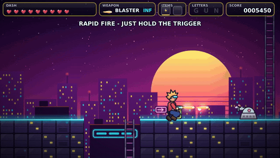
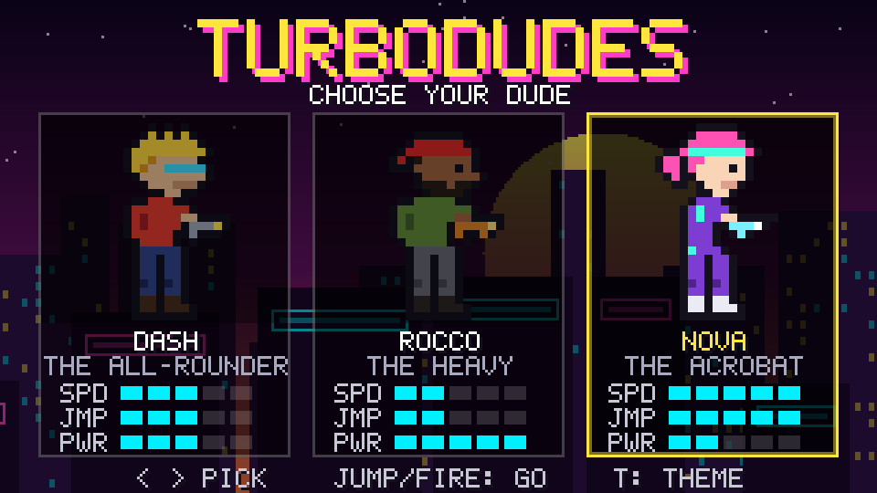
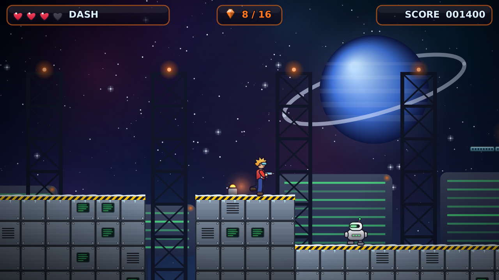

# Gunrunners

A jump-n-shoot platformer in the spirit of Duke Nukem II. Pick one of three
dudes (Dash, Rocco or Nova) and blast your way to the exit.

This is a **proof of concept**: one short level, three playable characters,
three enemy types, and three switchable visual themes that correspond to the
design directions in [docs/DESIGN.md](docs/DESIGN.md).



The game renders at 1280x720 with smooth, anti-aliased vector art, soft
glow lighting and parallax backdrops (no chunky pixels).

| Select screen | Lost Temple | Station Zero |
|---|---|---|
|  |  |  |

## Build and run

Developed and tested on Linux. Needs a C++17 compiler, CMake 3.16+, SDL2 and
Cairo:

```sh
sudo apt install build-essential cmake libsdl2-dev libcairo2-dev   # Debian/Ubuntu
sudo dnf install gcc-c++ cmake SDL2-devel cairo-devel              # Fedora
```

```sh
cmake -S . -B build -DCMAKE_BUILD_TYPE=Release
cmake --build build -j
./build/gunrunners
```

| Key | Action |
|-----|--------|
| Arrows / WASD | move, pick a dude |
| Z / Space | jump (hold for higher) |
| X / Ctrl | fire |
| Enter | confirm |
| T | cycle theme (Neon Overdrive, Lost Temple, Station Zero) |
| Esc | quit |

Useful flags: `--theme N`, `--character N`, `--skip-menu`, `--autoplay` (the
bot plays), `--level PATH`, `--fullscreen`. Run `--help` for all of them.

## Recording gameplay without a display

The game can run headless (SDL's software renderer, no display or GPU needed)
and stream raw frames, so clips can be recorded in CI or a container:

```sh
tools/record.sh 0 2 out/neon_nova   # theme 0, Nova -> out/neon_nova.mp4 (720p60) + .gif
```

The bot (`src/frontend/bot.cpp`) drives the normal input path, browses the
select screen, picks the requested dude and plays the level to the exit. Runs
are deterministic, so the same command always produces the same clip.

## Relationship to RigelEngine

[RigelEngine](https://github.com/lethal-guitar/RigelEngine) is a modern
reimplementation of the Duke Nukem II engine. We studied it as the reference
for this PoC but did not fork it, for two reasons:

1. **It is built around Duke Nukem II's data files.** Levels, sprites, actor
   behaviour and the game logic itself are loaded from or keyed to the
   original `NUKEM2.CMP` content. Using it for an original game would mean
   either producing assets in Duke 2's formats or rewriting most of
   `assets/`, `data/` and `game_logic/`.
2. **Rendering.** RigelEngine is built to reproduce Duke II's 320x200
   pixel look. Gunrunners is aiming for modern HD 2D graphics instead, so
   its renderer would not carry over either.

The PoC is therefore written from scratch and borrows ideas rather than
code. Gunrunners is licensed under the GPL (same as RigelEngine), so
individual RigelEngine pieces can still be reused later where they help,
with attribution.

What we took over from its design:

| RigelEngine | Gunrunners PoC |
|---|---|
| Module split `base / data / assets / engine / game_logic / frontend` | Same split under `src/` |
| Fixed-rate game logic decoupled from rendering | 60 Hz fixed tick in 320x180 "world pixels"; rendering at 4x (1280x720) with sub-pixel smooth motion |
| Tile map with per-tile collision attributes, one-way platforms | `data/level.cpp`, `game/world.cpp` |
| Dead-zone camera with capped scroll speed (`game_logic/camera.cpp`) | `engine/camera.cpp` |
| Entity activation: actors only update near the screen | `World::isActive` |
| Input abstraction + demo playback for attract mode | `game/input.hpp` + autoplay bot |
| Earthquake/screen shake, particle debris | `Camera::shake`, `World::explode` |

Unlike Duke Nukem II (and RigelEngine), the look is not low-res pixel art:
all graphics are original vector art drawn with Cairo at startup
(`src/assets/art.cpp`) and composited with SDL2 on the GPU, with additive
glow, particles, parallax and a vignette. No Duke Nukem assets are used.

## Layout

```
src/base       math, deterministic RNG
src/render     SDL2 renderer wrapper, Cairo vector helpers, text
src/assets     vector-drawn sprites, tiles and backdrops for each theme
src/data       level loader, themes, character stats
src/engine     camera
src/game       world simulation: player, enemies, bullets, pickups, effects
src/frontend   character select / level / results modes, autoplay bot
levels/        text level files (format in levels/README.md)
tools/         record.sh
docs/          design directions and media
```

## Next steps

- Pick a design direction and replace the programmer art with artist-made
  HD sprites (PNG or SVG; the renderer already works with textures).
- Sound effects and music (SDL_mixer).
- More enemy types, a weapon pickup system, checkpoints.
- A proper level editor workflow (e.g. Tiled `.tmx` import).
- Gamepad support.

## License

Gunrunners is free software under the GNU General Public License, version 2
or (at your option) any later version. See [LICENSE](LICENSE).
