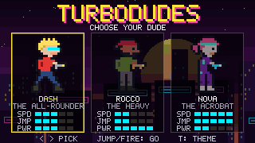
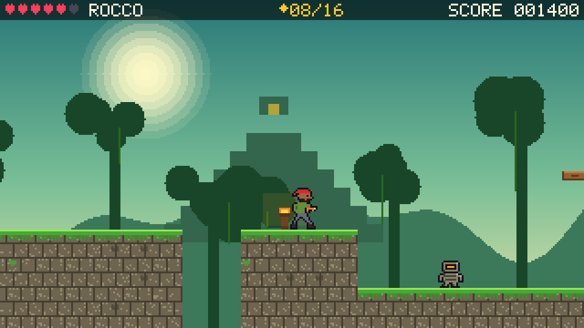

# TurboDudes

A jump-n-shoot platformer in the spirit of Duke Nukem II. Pick one of three
dudes (Dash, Rocco or Nova) and blast your way to the exit.

This is a **proof of concept**: one short level, three playable characters,
three enemy types, and three switchable visual themes that correspond to the
design directions in [docs/DESIGN.md](docs/DESIGN.md).



| Select screen | Temple of Turbo | Station Zero |
|---|---|---|
|  |  |  |

## Build and run

Needs a C++17 compiler, CMake 3.16+ and SDL2 (`libsdl2-dev` on Debian/Ubuntu,
`brew install sdl2` on macOS).

```sh
cmake -S . -B build -DCMAKE_BUILD_TYPE=Release
cmake --build build -j
./build/turbodudes
```

| Key | Action |
|-----|--------|
| Arrows / WASD | move, pick a dude |
| Z / Space | jump (hold for higher) |
| X / Ctrl | fire |
| Enter | confirm |
| T | cycle theme (Neon Overdrive, Temple of Turbo, Station Zero) |
| Esc | quit |

Useful flags: `--theme N`, `--character N`, `--skip-menu`, `--autoplay` (the
bot plays), `--level PATH`, `--scale N`. Run `--help` for all of them.

## Recording gameplay without a display

The game can run headless and stream raw frames, so clips can be recorded in
CI or a container:

```sh
tools/record.sh 0 2 out/neon_nova   # theme 0, Nova -> out/neon_nova.mp4 + .gif
```

The bot (`src/frontend/bot.cpp`) drives the normal input path, browses the
select screen, picks the requested dude and plays the level to the exit. Runs
are deterministic, so the same command always produces the same clip.

## Relationship to RigelEngine

[RigelEngine](https://github.com/lethal-guitar/RigelEngine) is a modern
reimplementation of the Duke Nukem II engine. We studied it as the reference
for this PoC but did not fork it, for two reasons:

1. **It is built around Duke Nukem II's data files.** Levels, sprites, actor
   behaviour and the game logic itself are loaded from or keyed to the
   original `NUKEM2.CMP` content. Using it for an original game would mean
   either producing assets in Duke 2's formats or rewriting most of
   `assets/`, `data/` and `game_logic/`.
2. **License.** RigelEngine is GPL-2.0. Copying its code would make
   TurboDudes GPL-2.0 as well. That is a decision for the project owners,
   so this PoC is written from scratch and only borrows ideas.

What we took over from its design:

| RigelEngine | TurboDudes PoC |
|---|---|
| Module split `base / data / assets / engine / game_logic / frontend` | Same split under `src/` |
| Fixed-rate game logic decoupled from rendering, low-res framebuffer upscaled | 60 Hz fixed tick, 320x180 framebuffer scaled with nearest neighbour |
| Tile map with per-tile collision attributes, one-way platforms | `data/level.cpp`, `game/world.cpp` |
| Dead-zone camera with capped scroll speed (`game_logic/camera.cpp`) | `engine/camera.cpp` |
| Entity activation: actors only update near the screen | `World::isActive` |
| Input abstraction + demo playback for attract mode | `game/input.hpp` + autoplay bot |
| Earthquake/screen shake, particle debris | `Camera::shake`, `World::explode` |

All graphics are original programmer art generated at startup from ASCII
pixel art (`src/assets/art.cpp`). No Duke Nukem assets are used.

## Layout

```
src/base       math, deterministic RNG
src/gfx        software framebuffer, sprite blitting, 5x7 bitmap font
src/assets     sprites, tiles and backdrops for each theme
src/data       level loader, themes, character stats
src/engine     camera
src/game       world simulation: player, enemies, bullets, pickups, effects
src/frontend   character select / level / results modes, autoplay bot
levels/        text level files (format in levels/README.md)
tools/         record.sh
docs/          design directions and media
```

## Next steps

- Pick a design direction and replace programmer art with real pixel art
  (the sprite pipeline can load PNGs instead of ASCII with little change).
- Sound effects and music (SDL_mixer).
- More enemy types, a weapon pickup system, checkpoints.
- A proper level editor workflow (e.g. Tiled `.tmx` import).
- Gamepad support.
