# Gunrunners

<p align="center">
  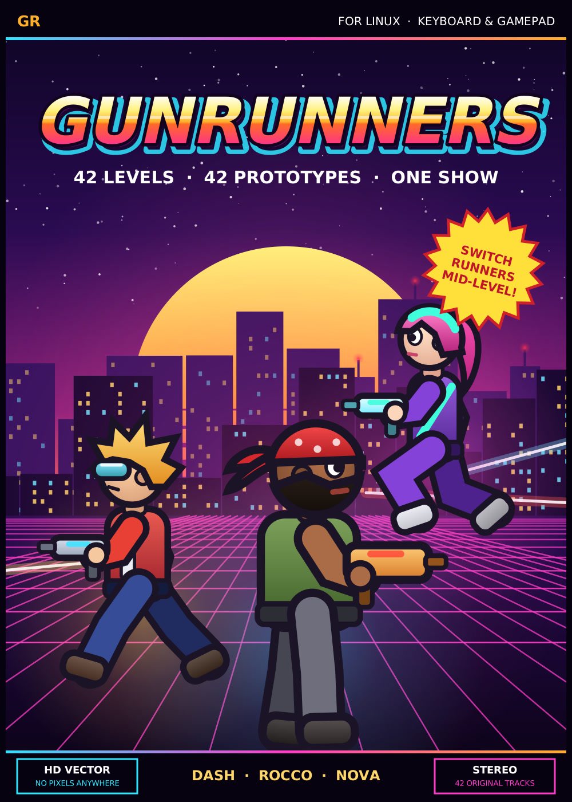
  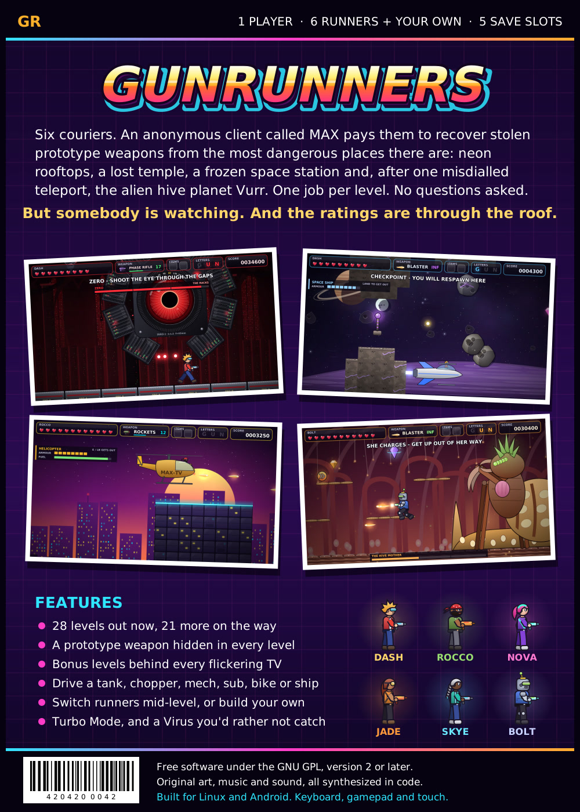
</p>

A jump-n-shoot platformer that plays like Duke Nukem II. Pick one of six
runners (Dash, Rocco, Nova, Jade, Skye or the robot Bolt), or build your
own in the runner editor, and blast your way to the exit.

A 42-level campaign in six episodes: every level has its own twist, its
own prototype weapon, its own soundtrack, a bonus level behind a flickering
TV, secrets and a briefing cutscene. Six episodes of seven levels each.
**Playable now:** all of Episode 1 (Levels 1-7) with its bonus levels and
ending, and all seven levels of Episode 2 (Level 8, Canopy Road,
Level 9, Hall of Traps, Level 10, Sun Mirrors, Level 11, Idol Mines,
Level 12, Lava Heart, Level 13, Boulder Run, and Level 14, The Idol
Awakens, with the Idol Golem) and its ending, and Episode 3 has begun
with Level 15, Hangar Bay, and its Asteroid Belt bonus, and Level 16,
Cryo Labs (Ice Floors and the Freeze Ray), with its Air Hockey bonus.
Episodes 3-6 are being built now.

| Rooftop Run: neon signs that are only solid on the beat | Club Laserdisc: bounce pads, bouncers and the bass drop |
|---|---|
| 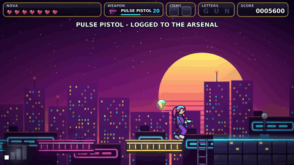 | 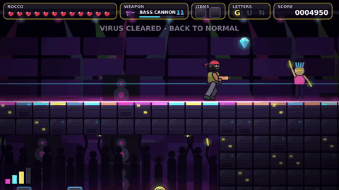 |
| **Maglev Express: a fight along a moving train** | **Chopper Down: the Black Halo gunship** |
| 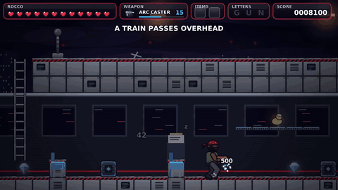 | 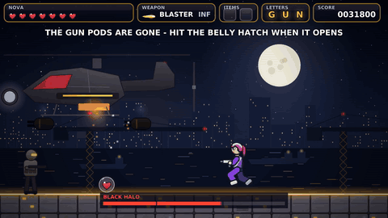 |

Smooth HD vector art with glowing neon, parallax backdrops and no chunky
pixels. Every sound and every note of music is made by the game itself.

## Episode 1: Neon Overdrive

| # | Level | Twist | Prototype | Bonus level |
|---|---|---|---|---|
| 1 | Rooftop Run | neon signs that are solid only on the beat | Pulse Pistol | Cloud Nine (air jumps) |
| 2 | Glass Canyon | pulley gondolas: weigh one down to lift the other | Spark Disc | Free Fall |
| 3 | Club Laserdisc | subwoofer pads that launch you on the bass drop | Bass Cannon | Step on the Beat (you move only on the beat) |
| 4 | Blackout | a city in the dark: relight it sector by sector | Flare Gun | Echo Room (sonar) |
| 5 | Sludge Line | a rising and falling tide of sludge, gators in it | Bubble Gun | Duck Rapids |
| 6 | Maglev Express | a running train: get inside a car before each tunnel | Arc Caster | Light Trail |
| 7 | Chopper Down | a boss fight against a gunship and its searchlight | Lock-On Rockets | Pilot Seat (you fly) |

| | |
|---|---|
| 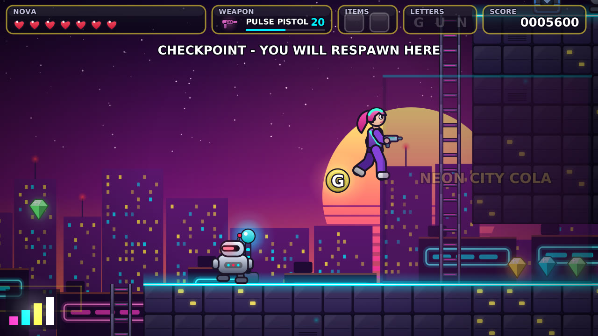 | 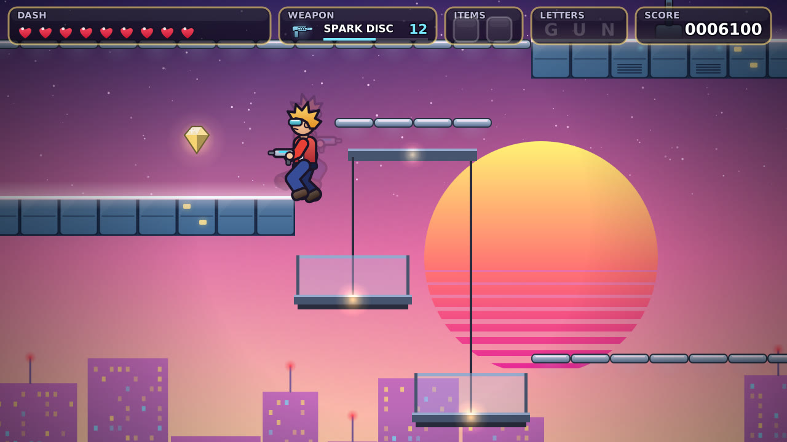 |
| 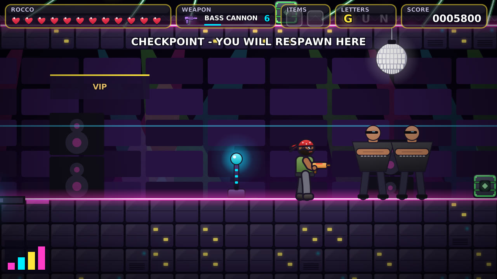 | 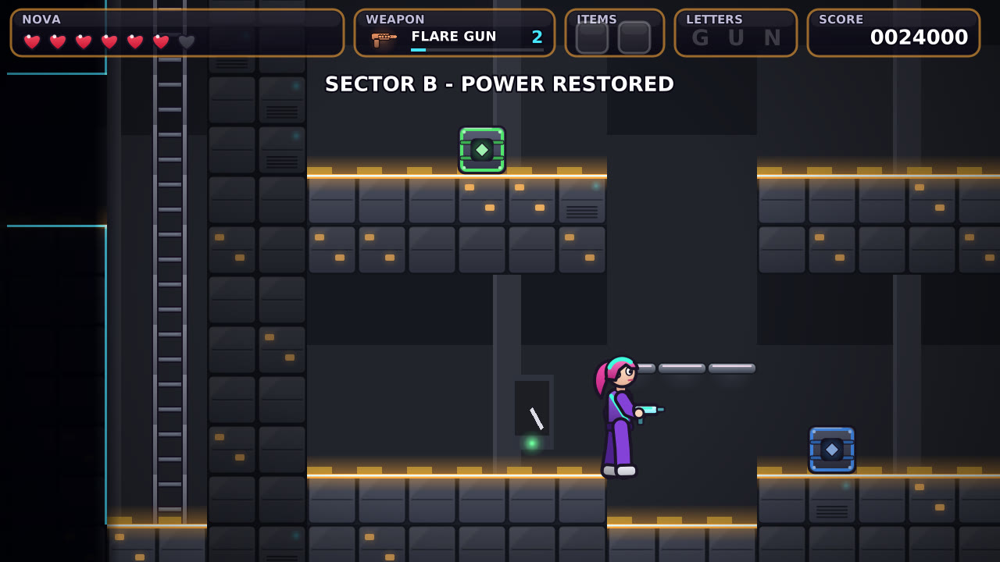 |
| 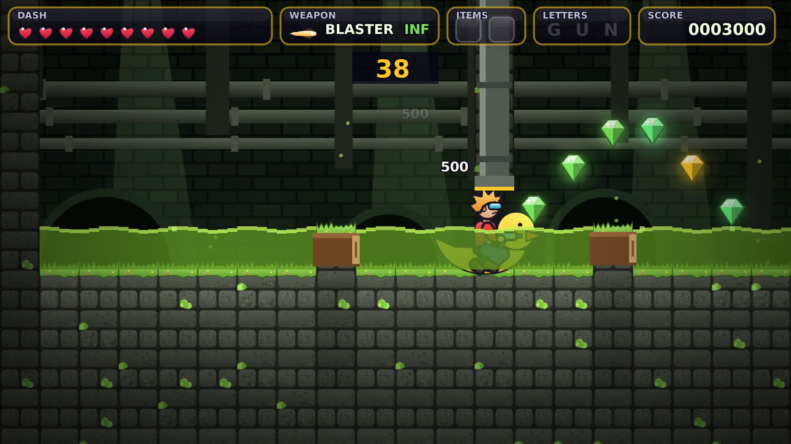 | 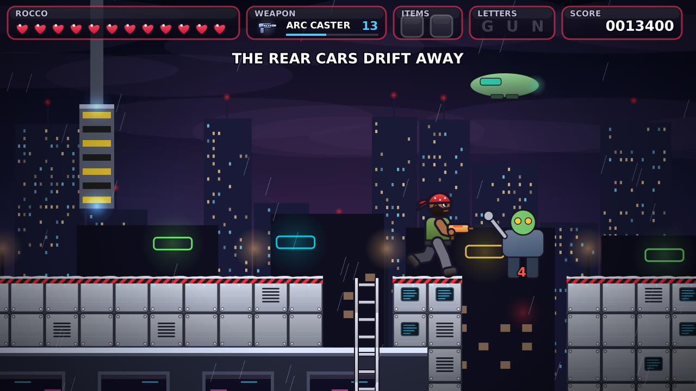 |
| 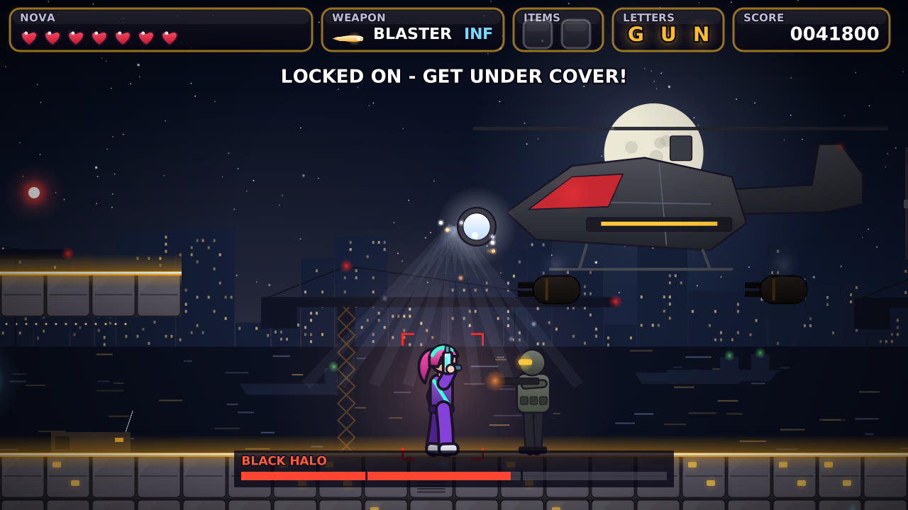 | 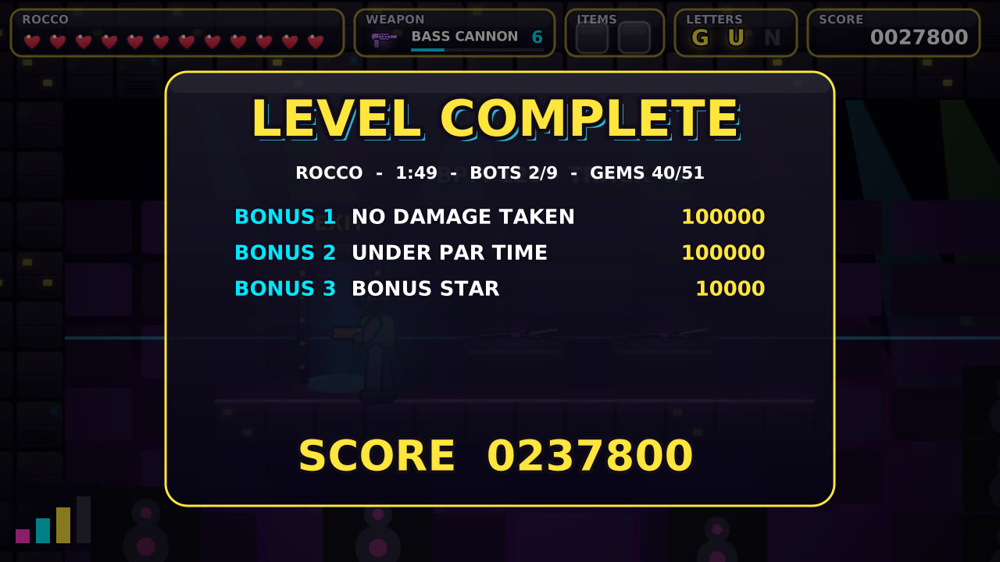 |
| 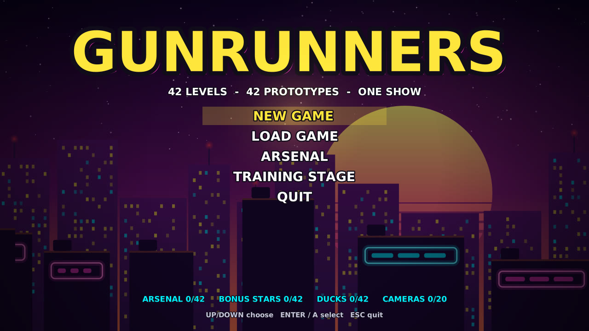 | 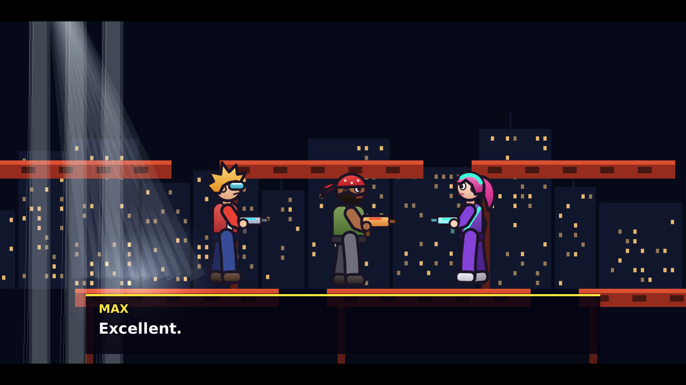 |

## Get the game

Gunrunners runs on Linux and Android.

**Android:** install it with [F-Droid](https://f-droid.org) from Paul's
F-Droid repository, <https://github.com/snonux/fdroid> (one-tap link and QR
code there). Or add `https://snonux.github.io/fdroid/repo` by hand under
*Settings → Repositories*, then search for Gunrunners. Play with the on-screen controls or a Bluetooth
or USB gamepad, connected at any time; the on-screen controls step aside
while you use the pad. Building the APK yourself is described in
[android/README.md](android/README.md).

**Linux (x86_64):** download `gunrunners-vX.Y.Z-linux-x86_64.tar.gz` from
the [latest release](https://github.com/snonux/gunrunners/releases/latest),
unpack it anywhere and start `gunrunners` in it. It needs SDL2 and Cairo,
which most desktops already have:

```sh
sudo apt install libsdl2-2.0-0 libcairo2 fonts-dejavu-core   # Debian/Ubuntu
sudo dnf install SDL2 cairo dejavu-sans-fonts                 # Fedora
tar xzf gunrunners-v*-linux-x86_64.tar.gz
gunrunners-v*-linux-x86_64/gunrunners
```

**Linux, from source** (any architecture): install the build tools and
libraries, then build and start it:

```sh
sudo apt install build-essential cmake libsdl2-dev libcairo2-dev   # Debian/Ubuntu
sudo dnf install gcc-c++ cmake SDL2-devel cairo-devel              # Fedora
./build.sh -r
```

After that, `./build/gunrunners` starts the game.

## Touch controls (Android)

In a level, the left half of the screen is a stick: put your thumb down
anywhere there and slide it. On the right are Fire (the big corner button),
Jump left of it, Switch runner above and, at the top, Pause and the Map. You don't have to hit them exactly:
a touch near them presses the nearest one, a thumb that drifts keeps its
button, and sliding onto another button switches to it. Or swipe: a quick
swipe up anywhere on the right half jumps (also with a thumb on Fire), a
quick swipe down switches runner. Push the stick up beside a vehicle to climb
in, and down + Jump to climb out. In menus you get a d-pad with OK and
BACK. CONTROLS on the title screen and in the pause menu sets the size
(TOUCH PAD: small, medium or large) and has EDIT TOUCH LAYOUT, where you
drag the stick and each button to where your thumbs want them. The back
key pauses. Leaving the app pauses the
game.

## Controls

Play with the keyboard or a gamepad (both work at the same time). These are
the defaults; CONTROLS on the title screen or in the pause menu changes them
(see below):

| Keyboard | Gamepad | Action |
|----------|---------|--------|
| Left / Right (A / D) | left stick or d-pad | walk, pick a runner |
| Up (W) | stick or d-pad up | climb a ladder, aim up, pull your legs in on a hang bar; hold to look up |
| Down (S) | stick or d-pad down | crouch, aim down from a hang bar; hold to look down |
| X / Ctrl | X (left face button) | jump (tap for a short hop), down+jump drops from a hang bar |
| Z / Space | A (bottom face button) or B, RB, right trigger | fire; with the flamethrower, down+fire is a jetpack |
| C | Y | switch to the next runner, right where you stand |
| E | LB (left trigger on Android) | get in or out of a vehicle (up beside one gets in too; down + jump gets out) |
| Esc / P | Start | pause menu: resume, save, load, quick save and load, change runner, quit |
| F5 | (bind one in CONTROLS) | quick save: no slot to pick, it goes to its own quick save slot |
| F9 | (bind one in CONTROLS) | quick load, mid-level or straight from the title screen |
| M | Back / Select (LB on Android) | the level map: what you have explored so far |
| Enter | A (or Start) | confirm in menus |
| Esc / Backspace | B | back out of a menu (Esc on the title screen quits) |
| T | | cycle theme (Neon Overdrive, Lost Temple, Station Zero) |
| F11 / Alt+Enter | | fullscreen on or off |

Most gamepads work out of the box (Xbox, PlayStation, Switch Pro, 8BitDo,
Steam Deck and generic USB or Bluetooth pads), and you can plug them in
while playing. Button names above are Xbox style; on PlayStation, A is
Cross and X is Square.

**Changing the controls.** Pick CONTROLS on the title screen or in the
pause menu. Each action has two keyboard keys and a gamepad button: choose
a cell with the arrows (or the d-pad), press Enter (or A), then press the
new key or button. Esc cancels. A key or button can only do one thing, so
taking it for one action frees it from the other. RESET TO DEFAULTS brings
back the table above. Your choice is saved with your profile and works on
Linux and Android alike. So that no setting can lock you out, the menus
always answer the arrows, Enter, Esc, the d-pad, A, B and Start, Esc and
Start always pause, and the left stick always walks.

**Fullscreen** fills your screen with no window frame. Press F11 or
Alt+Enter, or pick FULLSCREEN on the title screen or in the pause menu. The
game remembers your choice.

## The campaign

A new game plays the opening movie, then each level's briefing, the level,
the tally and, after an episode's last level, its ending. Any button skips
a cutscene. The TRAINING STAGE on the title screen is a free-play level for
trying the controls.

- **Prototypes and the Arsenal.** Each level hides its own prototype weapon
  in a green box. Reach the exit with it and it joins your Arsenal, with
  your best kill count.
- **Bonus levels.** Find the patch of TV static and press up. "WE'LL BE
  RIGHT BACK!": a short level with crazy rules and a timer, then you are
  back where you were with everything you had. Beat it for a Bonus Star
  and a slot in the Bonus Channel.
- **Secrets.** A rubber duck in every level, candid cameras, hidden gem
  caches and the number 42 somewhere.
- **Savegames.** Five slots, from the pause menu or LOAD GAME on the title
  screen. A save keeps everything: your runner, score, health, weapons,
  items and what is left of the level. A sixth, the quick save, needs no
  menu: F5 saves and F9 loads (both rebindable, and also in the pause menu).

## Plays like Duke Nukem II

The movement is a frame-accurate port of Duke Nukem II's (via
[RigelEngine](https://github.com/lethal-guitar/RigelEngine)): the same jump
arc, ladders, hang bars, the flamethrower jetpack, Duke's weapons with
limited ammo, colour-coded item boxes, the letters G-U-N and the
end-of-level bonus tally. The runners differ in health and jump height
and in what they start with: Rocco has rockets, Nova and Bolt the laser,
Jade a full flamethrower and Skye rapid fire.

On top of that:

- **Switch runners mid-level.** Press C (gamepad Y) to swap to the next
  runner right where you stand. Your weapon, ammo and items carry over.
- **Runner editor.** NEW RUNNER on the runner select screen makes your own:
  human or robot, build, hair (or head kit), face (or optics), outfit,
  colours, name, starting gun, and ten stat points to spread over health,
  jump and power. REMIX starts from a built-in runner, EDIT changes one of
  yours. Your runners live in `runners.txt` next to the savegames, and a
  save remembers its runner even after you delete it.
- **The map.** Press M (gamepad Back) for a map of the level that fills
  itself in as you explore: walls, ledges, ladders, hazards, doors still
  shut, checkpoints and the exit once you have seen them, and where you
  are. It pauses the game. It opens zoomed in on your runner; Enter (A)
  shows the whole level, the arrows or the stick pan, and M, Esc or B
  closes it. Savegames keep the map. Dark sectors only map where they are
  lit or right around you.
- **Turbo Mode.** A white box with an orange core maxes out every stat for
  15 seconds: no damage, double speed, a huge jump, nonstop fire, double
  damage.
- **Virus.** A floating green germ makes you sick for 8 seconds: slow,
  with a low jump and weak shots. Shoot it from a distance, or cure it with
  Turbo.

## Cheats (a little secret)

Pause the game and enter **up, up, down, down, left, right, left, right**
(arrow keys, WASD, the d-pad or the stick all work). A chime plays and the
pause menu gains a **CHEATS** entry:

| Cheat | What it does |
|---|---|
| GOD MODE | toggle: nothing hurts you (falling off the map still does) |
| FULL HEALTH | refills your hearts |
| PROTOTYPE + FULL AMMO | the level's prototype weapon, fully loaded |
| TURBO MODE | starts Turbo Mode on the spot |
| CURE THE VIRUS | ends an infection |
| ACCESS CARD | the card that switches off force fields |
| RAPID FIRE | the rapid-fire power-up |
| SKIP THE LEVEL | beams you out through the exit |

The code is remembered until you quit; `--cheats` shows the entry from the
start. Cheating has a price, as it should: a level you cheated in pays no
tally bonuses, and its score, time, Bonus Star and Arsenal entry are not
recorded in your profile. Savegames remember that you cheated.

## Sound and music

Every level has its own soundtrack, each in a style of its own: synthwave
on the rooftops, a house track in the club, dub in the sewers, marimba and
congas in the jungle, a slide guitar in the desert, a waltz on the
accordion, a noir trumpet in the rain, big band, arena rock and more, up to
a medley for the finale. Bonus levels and cutscenes get their own tracks
too. All of it, sound effects included, is synthesized by the game: no
samples.

## More

Building from source, command-line options, tests, gameplay recording, the
engine and how it relates to Duke Nukem II and RigelEngine are in
[docs/DEVELOPMENT.md](docs/DEVELOPMENT.md). The three visual themes (press
T) are described in [docs/DESIGN.md](docs/DESIGN.md).

## License

Gunrunners is free software under the GNU General Public License, version 2
or (at your option) any later version. See [LICENSE](LICENSE).
