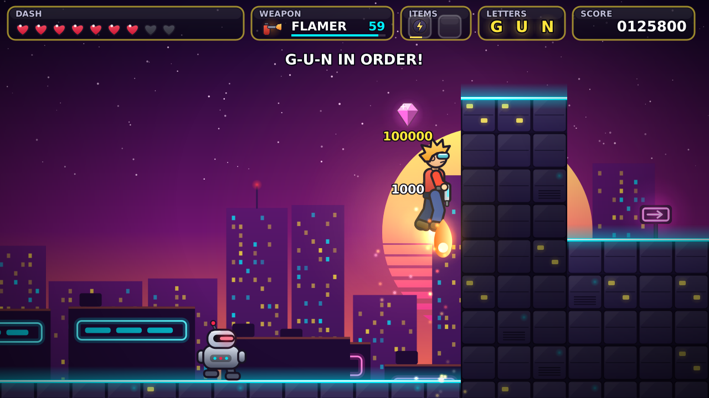

# Gunrunners: three design directions

Gunrunners is a side-scrolling jump-n-shoot in the spirit of Duke Nukem II:
pick one of three dudes, run and gun through short, dense levels, grab gems,
reach the exit. The cast is fixed across all three directions:

| Dude  | Role           | Feel                                   | Weapon in the PoC |
|-------|----------------|----------------------------------------|-------------------|
| Dash  | The all-rounder | Balanced speed and jump, 4 hearts     | Blaster: single bolts, medium rate |
| Rocco | The heavy      | Slowest, lowest jump, 6 hearts         | Scatter gun: three pellets, short range |
| Nova  | The acrobat    | Fastest, highest jump, only 3 hearts   | Rapid laser: weak but very fast |

The PoC renders in HD (1280x720, smooth vector art rather than chunky
pixels) and can show the same level in all three directions (press **T** in
game, or `--theme 0|1|2`), so we can compare them in motion before we pick one
or mix them.

---

## 1. Neon Overdrive

**Pitch:** 1980s synthwave action movie. Neon City at night, seen from its
rooftops.

- **Levels:** rooftops, billboards, highway overpasses, a night club, a
  laser-grid server tower. Backdrop is a striped sunset and layered skylines
  with lit windows; tiles are dark violet blocks with cyan neon trim.
  Platforms are glowing magenta bars.
- **Palette:** deep purple and navy, hot magenta, cyan, yellow highlights.
- **Enemies:** chrome security bots, hover drones, wall turrets, later
  a boss helicopter.
- **Dudes:** Dash in a red bomber jacket and cyan shades, Rocco as an ex-cop
  with a bandana and a heavy shotgun, Nova as a courier in a purple
  racing suit with a ponytail.
- **Signature mechanic:** neon signs that flicker on and off as temporary
  platforms; power cuts that darken parts of a level.

## 2. Lost Temple

**Pitch:** pulpy 1930s jungle adventure. Ancient ruins hide a golden idol.

- **Levels:** overgrown temple courtyards, rope bridges, flooded caves,
  lava chambers, a golden inner sanctum. Backdrop is hazy jungle with a
  stepped pyramid on the horizon; tiles are mossy stone bricks with a grass
  lip; platforms are wooden planks.
- **Palette:** teal and jade sky, warm stone, gold and torch orange.
- **Enemies:** stone guardians, cult drones (wooden masks), dart traps,
  giant spiders, an idol golem boss.
- **Dudes:** Dash as a treasure hunter with goggles, Rocco as a strongman
  guide with a machete, Nova as an aviator who crash-landed nearby.
- **Signature mechanic:** traps (spikes, rolling boulders, collapsing floors)
  that can be triggered on purpose to take out enemies.

## 3. Station Zero

**Pitch:** a frozen orbital research station whose AI has locked the crew out.

- **Levels:** hangar bays, cryo labs, reactor core, exterior hull walks with
  low gravity. Backdrop is a starfield, a ringed planet and truss towers;
  tiles are riveted steel panels with yellow-black hazard edges and frost;
  platforms are metal grates.
- **Palette:** near-black space blue, cold steel, warning orange and
  terminal green.
- **Enemies:** maintenance robots, security drones, ceiling turrets, slime
  creatures escaped from the labs, the station AI as the final boss.
- **Dudes:** Dash as a station mechanic, Rocco as a heavy-suit cargo loader,
  Nova as the station's test pilot.
- **Signature mechanic:** gravity switches and slippery ice floors; airlocks
  that suck enemies (and careless dudes) out.

---

## Recommendation

Start with **Neon Overdrive** for the first episode: it reads best at low
resolution, suits the gun-toting action of the name, and its blocky city geometry is the
cheapest to produce tiles for. Lost Temple and Station Zero make good
episode 2 and 3 worlds, which also matches the Duke-style episodic structure.

## Open questions for the next round

- Do all dudes share one weapon with upgrades (Duke style), or keep a
  signature weapon each (current PoC)?
- Lives and checkpoints, or restart the level on death (current PoC)?
- HD art direction: keep the clean vector look of the PoC, or commission
  painted sprites from an artist?
- Target platforms: desktop only, or also web (RigelEngine supports
  Emscripten) and handheld (Steam Deck)?
